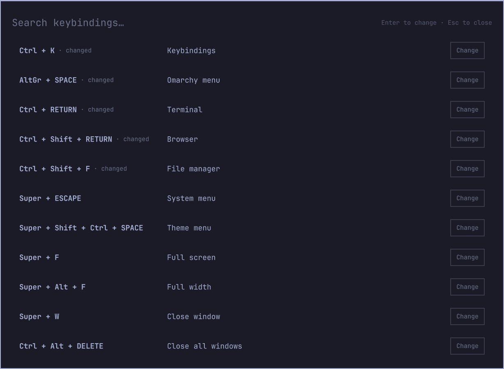
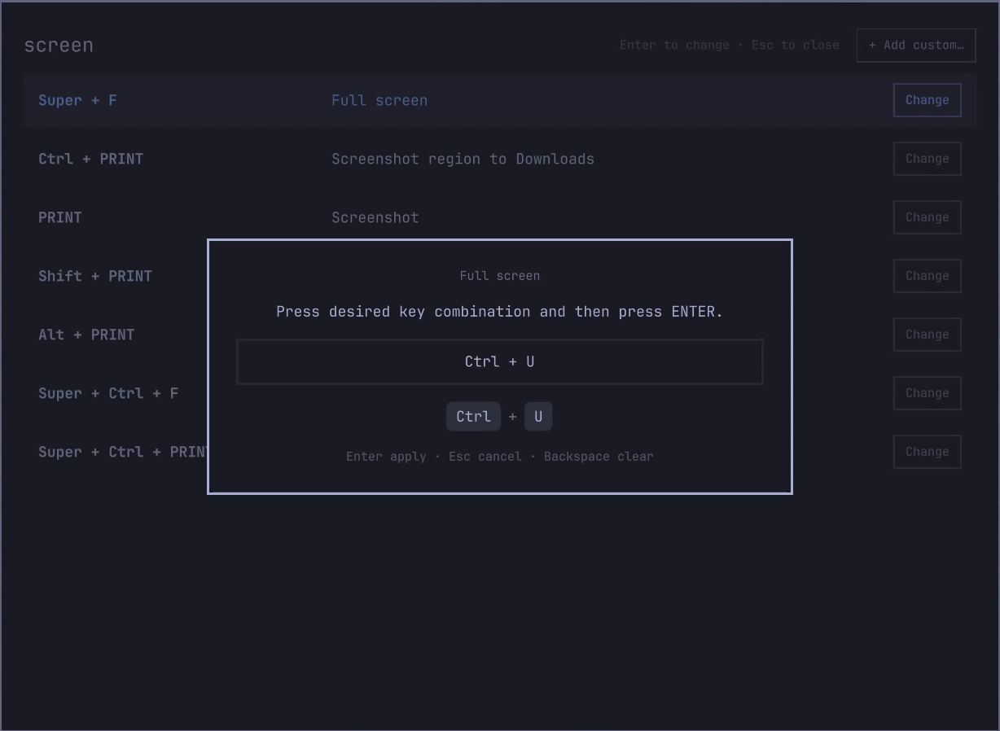
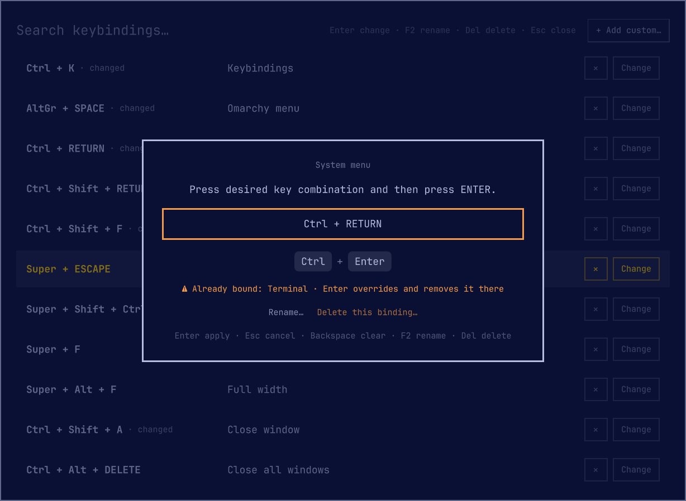
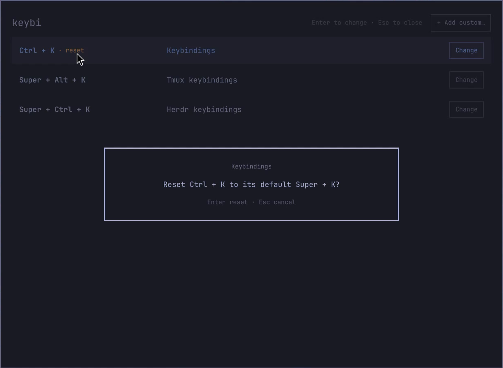
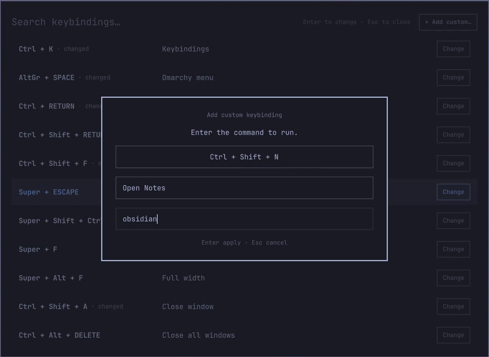

# Astro Keybind Editor

A shell plugin for [Omarchy](https://omarchy.org) Quattro that turns the
keybindings viewer into an editor. It lists every effective Hyprland binding with a
**Change** button. Press the new combination in a capture dialog and the
rebind applies immediately. No config editing, no reload.


## Features

- Rebinds any binding, including the Omarchy defaults.
- Conflicts show in orange. If you apply anyway, the combo is removed from
  the other action.
- Reset a changed binding to its default: hover its marker and click "reset".
- Add custom keybindings: press a combo, type a description and a command.
- Delete a binding from its capture dialog: **Del**, then Enter to confirm.
  A custom binding loses its `o.bind` line; anything else is disabled
  through the remap file.
- All rebinds live in one file: `~/.config/hypr/keybind-remaps.lua`. Review
  it, version it, or copy it to another machine. A `keybind-remap` hook
  fires on every change, for backups or auto-commits (see [Backup](#backup)).
- The stock read-only menu stays available: `omarchy menu keybindings`.

## Install

```bash
omarchy plugin add https://github.com/astrofoundry/omarchy-keybind-editor.git --enable
bash ~/.config/omarchy/plugins/astrofoundry.keybind-editor/install.sh
```

The second command installs the config-side hook (see
[How it works](#how-it-works)). It is
safe to run again. Also on the
[Omarchy plugin marketplace](https://plugins.omarchy.org/plugin.html?id=astrofoundry.keybind-editor).

Then bind a key to the editor in `~/.config/hypr/bindings.lua`:

```lua
hl.unbind("SUPER + K") -- Previously: the read-only keybindings menu.
o.bind("SUPER + K", "Keybindings", "omarchy-shell shell toggle astrofoundry.keybind-editor")
```

### Update

```bash
omarchy plugin update astrofoundry.keybind-editor --yes
```

Without `--yes` the command shows the incoming changes in a pager (`q` to
close) and asks for confirmation. When a release changes the config-side
hook, the release notes tell you to re-run `install.sh`.

## Screenshots

<table>
  <tr>
    <td align="center">
      <a href="screenshots/list.png"></a>
      <br><sub>List</sub>
    </td>
    <td align="center">
      <a href="screenshots/capture.png"></a>
      <br><sub>Capture</sub>
    </td>
    <td align="center">
      <a href="screenshots/conflict.png"></a>
      <br><sub>Conflict</sub>
    </td>
    <td align="center">
      <a href="screenshots/reset.png"></a>
      <br><sub>Reset</sub>
    </td>
    <td align="center">
      <a href="screenshots/add.png"></a>
      <br><sub>Add custom</sub>
    </td>
  </tr>
</table>

## Usage

- Type to search. Arrows to navigate.
- **Enter** or the **Change** button opens the capture dialog for a row.
- In the dialog: press the new combination, then **Enter** to apply.
  **Backspace** clears. **Esc** cancels. **Del** deletes the binding after
  an Enter confirmation (bare Del is therefore not capturable as a combo;
  modified combos like Super+Del still are).
- Capturing a binding's original combination also restores its default.
- Custom bindings land as `o.bind(...)` lines in
  `~/.config/hypr/bindings.lua`. Changing or deleting one edits that line in
  place, so custom rows never show the changed marker. A failed reload rolls
  the file back.
- To restore an overridden (removed) binding, delete its empty-value line in
  `~/.config/hypr/keybind-remaps.lua`.

## Backup

All rebinds live in one file: `~/.config/hypr/keybind-remaps.lua`. Three
options, from manual to automatic:

**Copy the file.** Copy it anywhere to back up. Copy it back and run
`hyprctl reload` to restore.

**Version it in a dotfiles repo.** Move the file into your repo and leave a
symlink. The editor writes through the symlink:

```bash
mv ~/.config/hypr/keybind-remaps.lua ~/dotfiles/keybind-remaps.lua
ln -s ~/dotfiles/keybind-remaps.lua ~/.config/hypr/keybind-remaps.lua
```

**Run a script on every change.** After each rebind the editor fires the
`keybind-remap` hook with the applied operations as arguments
(`set <original> <replacement>`, `delete <original>`, `disable <original>`,
`add <combo> <description> <command>`,
`remove <combo> <description> <command>`,
`update <old-combo> <new-combo>`).
Install a script:

```bash
omarchy hook install keybind-remap my-script.sh
```

Combined with the symlink above, this script commits every rebind:

```bash
#!/bin/bash
git -C ~/dotfiles add keybind-remaps.lua
git -C ~/dotfiles commit -m "keybind remap: $*" --quiet
```

## How it works

Hyprland reports Lua-registered binds without a recoverable action, so
editing binds by rewriting actions is a dead end. Instead the plugin uses
the fact that every binding, default or personal, passes through `hl.bind`
when the config loads. `install.sh` adds a small hook, loaded before the
Omarchy defaults, that wraps `hl.bind`/`hl.unbind` and rewrites combos
according to `~/.config/hypr/keybind-remaps.lua`. A remap moves a binding
without touching its action. An empty remap removes it.

The overlay lists binds by re-executing the Hyprland Lua config with a
stubbed API, the same technique the stock menu uses. The list always
matches what Hyprland registered, remaps included.

## Files

| File | Role |
|---|---|
| `KeybindEditor.qml` | Overlay UI and capture dialog |
| `KeybindModel.js` | Parsing, normalization, ordering, conflict logic |
| `extract-binds.lua` | Lists effective binds from the Lua config |
| `apply-remap.sh` | Rewrites the remap table, reloads Hyprland, fires the `keybind-remap` hook |
| `add-bind.sh` | Appends a custom `o.bind` to `bindings.lua`, validates, rolls back on error |
| `remove-bind.sh` | Deletes an editor-added `o.bind` line from `bindings.lua`, validates, rolls back on error |
| `update-bind.sh` | Rewrites the combo of an editor-added `o.bind` line in place, validates, rolls back on error |
| `xkb-symbols.sh` | Keycode/name maps for display and comparison |
| `hypr/keybind-remap-hook.lua` | The remap layer, installed by `install.sh` |

## Uninstall

```bash
omarchy plugin remove astrofoundry.keybind-editor
```

Then remove the `require("hypr.keybind-remap-hook")` line from
`~/.config/hypr/hyprland.lua` and delete
`~/.config/hypr/keybind-remap-hook.lua`. Keep or delete
`~/.config/hypr/keybind-remaps.lua`; without the hook it has no effect.

## Requirements

Stock Omarchy (Hyprland Lua config, omarchy-shell, `lua`, `jq`, `gawk`,
`xkbcli`).
